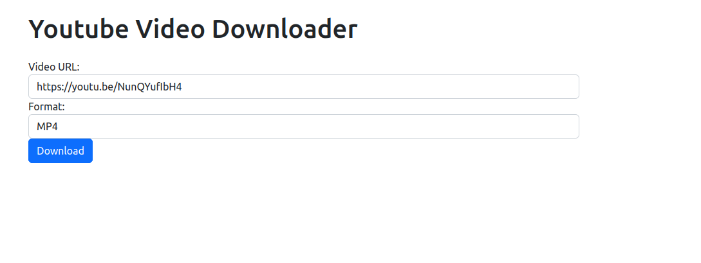

YouTube Video Downloader

A simple web application built with Django that allows users to download YouTube videos. The application uses the Pytube library to download videos in either MP4 or WebM format.

Features

    Download YouTube videos in either MP4 or WebM format
    Specify a custom download directory (optional)
    Responsive web design using Bootstrap 4

Requirements

    Python 3
    Django 3
    Pytube 11

Installation

    Clone the repository:

bash

git clone https://github.com/chiagoziemng/youtube-video-downloader.git

    Navigate to the project directory:

bash

cd youtube-video-downloader

    Install the required packages:

pip install -r requirements.txt

    Start the Django development server:

python manage.py runserver

    Open your web browser and navigate to http://localhost:8000.

Usage

    Enter the URL of the YouTube video you want to download.
    Select the desired format (MP4 or WebM).
    (Optional) Specify a custom download directory.
    Click the "Download" button.
    The video will be downloaded to your specified download directory (or the default download directory if none was specified).

License

This project is licensed under the MIT License. See the LICENSE file for details.

Contributing

Contributions are welcome! To contribute to this project, please follow these steps:

    Fork the repository.
    Create a new branch.
    Make your changes and commit them.
    Push your changes to your forked repository.
    Submit a pull request.

Credits

This project was created by Your Chiagoziem James

Contact

If you have any questions or comments about this project, please feel free to contact me at chiagoziemjamesng@gmail.com.
